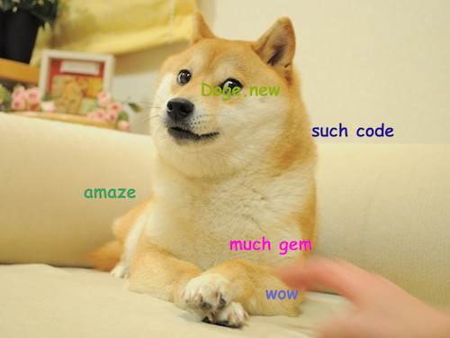

# Doge

[](http://badge.fury.io/rb/doge)

```
such gem

						amaze


			so ruby

							wow
```

## Installation

Add this line to your application's Gemfile:

    gem 'doge'

And then execute:

    $ bundle

Or install it yourself as:

    $ gem install doge

## Usage

```ruby
require 'doge'

Doge.new do
  such "code"
  wow
  so "ruby"
  amaze
  wuff "Doge.new"
end.image.write("output.jpg")
```

Will write the image to disk:



`#image` will return an [`Magick::Image`](http://www.simplesystems.org/RMagick/doc/imageattrs.html).

Available methods are `such`, `wow`, `so`, `amaze`, `very` and `wuff` which writes a custom string.

## Contributing

1. Fork it
2. Create your feature branch (`git checkout -b my-new-feature`)
3. Commit your changes (`git commit -am 'Add some feature'`)
4. Push to the branch (`git push origin my-new-feature`)
5. Create new Pull Request
